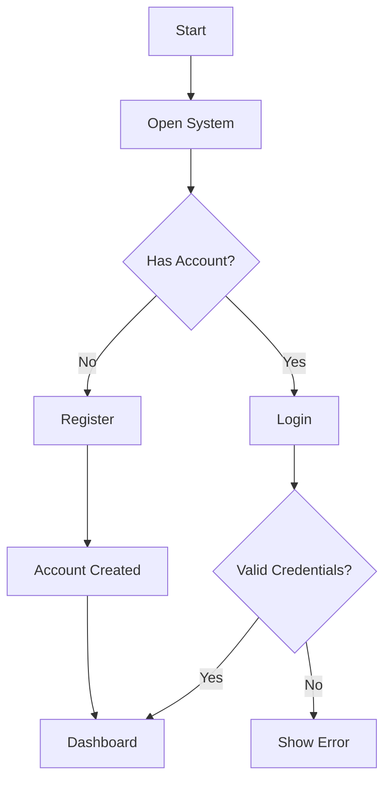
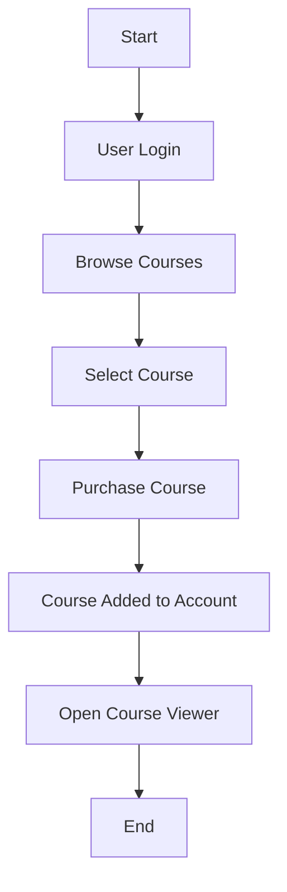
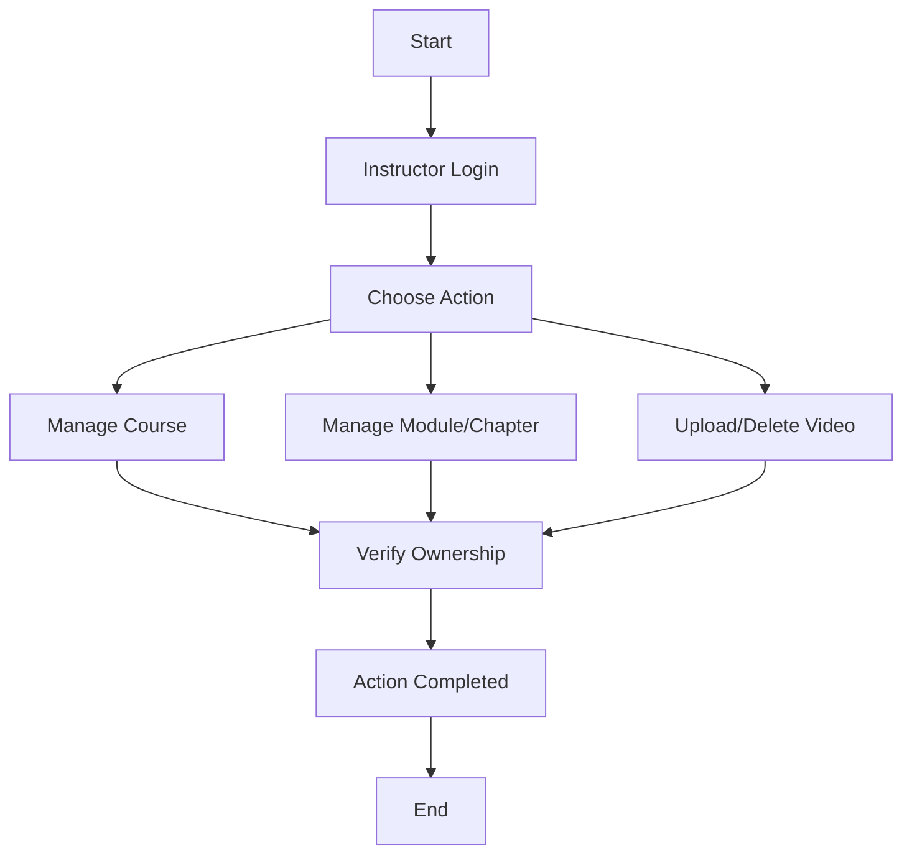
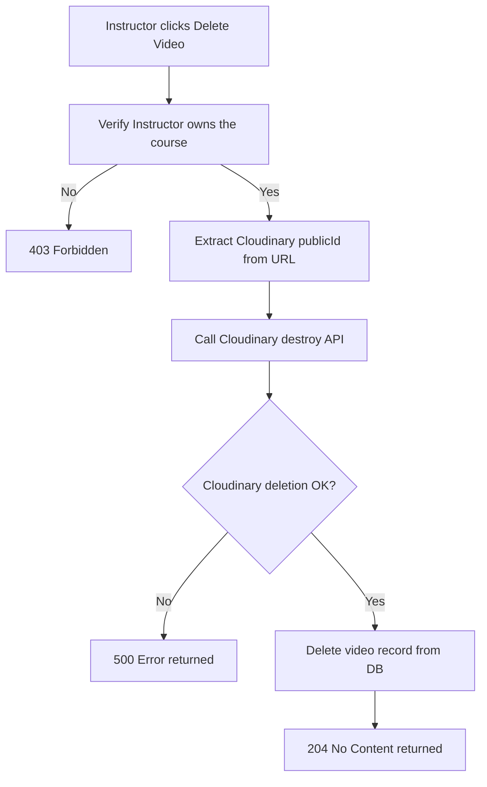
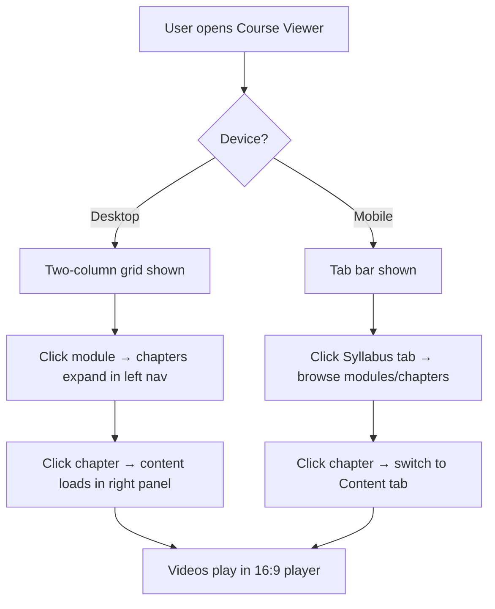
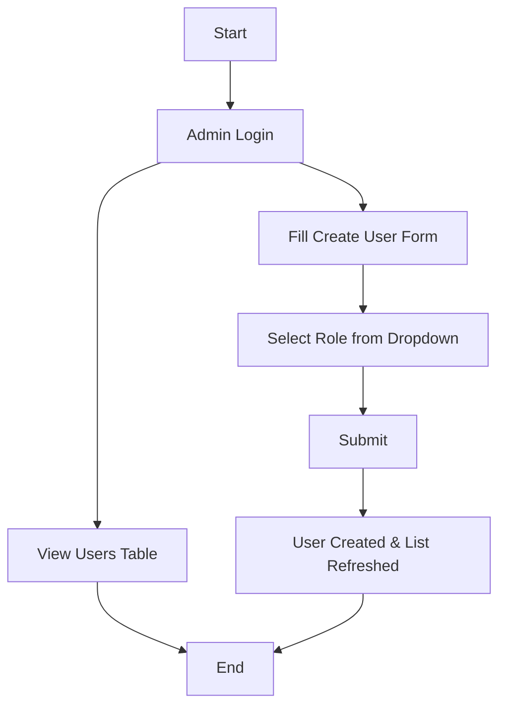

# 📘 Functional Document – LearnFlow LMS

## 1) Purpose
This document explains **what LearnFlow does and how users interact with it**. It describes system features including course content delivery, video management, and a future AI assistant to help learners.

---

## 2) Project Scope

### ✅ Current Features
LearnFlow allows:
- Users to create accounts and log in
- Different roles (Admin, Instructor, User)
- Viewing available courses in a public catalog
- Instructors to manage their courses, modules, chapters, and videos
- Instructors to upload and delete videos (with Cloudinary storage)
- Users to purchase and watch courses with a structured chapter viewer
- Admins to view all users and create new users from the admin panel

### 🚀 Upcoming Feature
- AI assistant to answer learner questions related to courses

---

## 3) User Roles

### 👤 Guest
- Can view the public course catalog
- Can create an account

### 👤 User (Student)
- Can update profile
- Can purchase courses
- Can view course modules, chapters, and videos via the Course Viewer
- Can access AI assistant (after purchasing course — future feature)

### 👨‍🏫 Instructor
- Can create, update, and delete own courses
- Can create, update, and delete modules within a course
- Can create and delete chapters within a module
- Can upload videos to chapters (stored on Cloudinary)
- Can delete videos (removed from both Cloudinary and the database)

### 🛠 Admin
- Can view all registered users
- Can create new users directly from the admin panel with role assignment

---

## 4) Functional Modules

### 4.1 User Registration & Login
- Users can create an account
- Users can log in securely with HTTP Basic Auth
- System identifies user role after login

---

### 4.2 Course Browsing
- Anyone can view the course list
- Courses include: Name, Description, Price, Duration, Status

---

### 4.3 Course Management (Instructor)
- Instructor can:
  - Create, update, and delete courses
  - View only their own courses in the Studio
  - Create and delete modules within a course
  - Create and delete chapters within a module
  - Upload videos to chapters (Cloudinary + database record)
  - Delete videos (both the Cloudinary file and database record are removed)

---

### 4.4 Course Viewer (User)
- After purchasing a course, users can open the Course Viewer
- **Desktop**: Two-column layout — Syllabus on the left, chapter content on the right
- **Mobile**: Tab-based layout — "📚 Syllabus" and "📖 Content" tabs that switch views
- Clicking a module expands its chapters in the syllabus
- Clicking a chapter loads the chapter content and its videos in the right panel
- Videos are displayed in a 16:9 player; video title is shown below with a "Show more" toggle for long names

---

### 4.5 Course Purchase (User)
- User can purchase available published courses
- Purchased courses are linked to the user account

---

### 4.6 Admin Features
- Admin can view all registered users in a directory table
- Admin can create new users via a styled form with role dropdown:
  - `USER`, `INSTRUCTOR`, `ADMIN`, `USER + INSTRUCTOR`, `USER + ADMIN`

---

## 5) AI Assistant (Future Feature)

### 🎯 Goal
Help students by answering course-related questions instantly.

### 👥 Who Can Use It
- Only users who purchased the course

### ⚙️ Features
- Ask questions in simple language
- Get answers based on course content
- View previous questions and answers
- Give feedback (helpful / not helpful)
- System shows fallback if unsure

---

## 6) Rules & Conditions
- Only logged-in users can perform actions requiring authentication
- Instructors can only manage their own courses, modules, chapters, and videos
- Deleting a video removes both the Cloudinary file and the database record
- AI can be used only after course purchase (future feature)
- Users cannot access others' data
- System protects user information

---

## 7) Acceptance Criteria

System is successful if:
- User can register and log in
- Courses are visible to everyone
- Instructor manages only own courses, modules, chapters, and videos
- Video upload stores to Cloudinary and saves the URL; delete removes from both
- User can purchase a course
- Course Viewer shows a two-column layout on desktop and tab layout on mobile
- Clicking a chapter shows content and videos in the right panel (does not shift layout)
- Admin can see user list and create new users with a role
- AI answers course-related questions (future)
- AI blocks users without course access (future)

---

## 8) Out of Scope
(Not included right now)
- Online payments
- Multiple languages
- Voice assistant
- Advanced analytics

---

# 🔄 Flowcharts

## 1) User Registration & Login Flow

## 2) Course Purchase Flow

## 3) Instructor Course Management Flow

## 4) Video Delete Flow

## 5) Course Viewer Flow

## 6) Admin Flow

