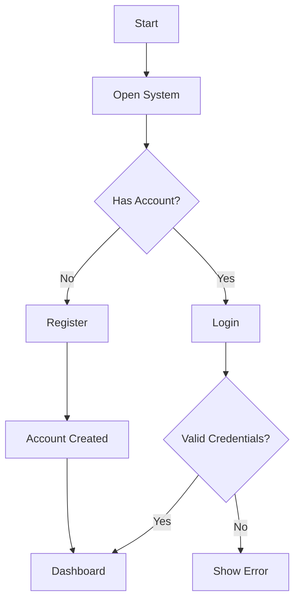
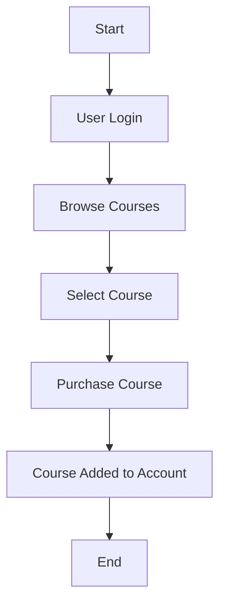
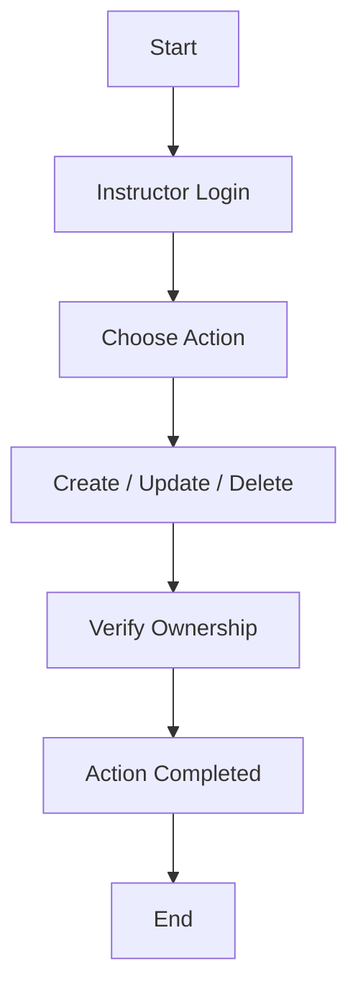
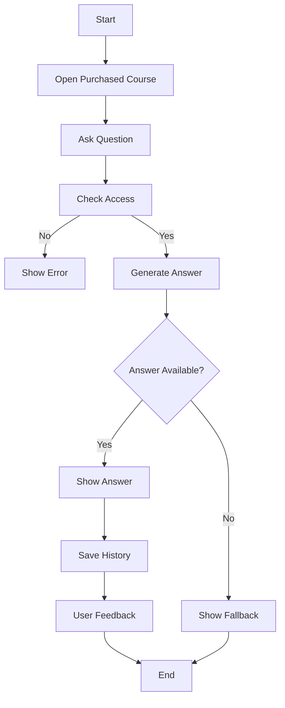
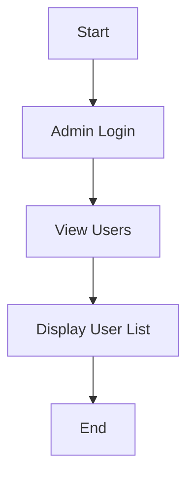

# 📘 Functional Document – LearnFlow LMS

## 1) Purpose
This document explains **what LearnFlow does and how users interact with it**. It describes system features in a simple way, including a future AI assistant to help learners.

---

## 2) Project Scope

### ✅ Current Features
LearnFlow allows:
- Users to create accounts and log in  
- Different roles (Admin, Instructor, User)  
- Viewing available courses  
- Instructors to manage their courses  
- Users to purchase courses  
- Admin to view all users  

### 🚀 Upcoming Feature
- AI assistant to answer learner questions related to courses  

---

## 3) User Roles

### 👤 Guest
- Can view courses  
- Can create an account  

### 👤 User (Student)
- Can update profile  
- Can purchase courses  
- Can access AI assistant (after purchasing course)  

### 👨‍🏫 Instructor
- Can create, update, and delete own courses  

### 🛠 Admin
- Can view all users  

---

## 4) Functional Modules

### 4.1 User Registration & Login
- Users can create an account  
- Users can log in securely  
- System identifies user role after login  

---

### 4.2 Course Browsing
- Anyone can view course list  
- Courses include:
  - Name  
  - Description  
  - Price  
  - Duration  

---

### 4.3 Course Management (Instructor)
- Instructor can:
  - Create course  
  - View own courses  
  - Update course  
  - Delete course  

---

### 4.4 Course Purchase (User)
- User can purchase available courses  
- Purchased courses are linked to user account  

---

### 4.5 Admin Features
- Admin can view all registered users  

---

## 5) AI Assistant (Future Feature)

### 🎯 Goal
Help students by answering course-related questions instantly.

### 👥 Who Can Use It
- Only users who purchased the course  

### ⚙️ Features
- Ask questions in simple language  
- Get answers based on course content  
- View previous questions and answers  
- Give feedback (helpful / not helpful)  
- System shows fallback if unsure  

---

## 6) Rules & Conditions
- Only logged-in users can perform actions  
- AI can be used only after course purchase  
- Users cannot access others' data  
- System protects user information  

---

## 7) Acceptance Criteria

System is successful if:
- User can register and log in  
- Courses are visible to everyone  
- Instructor manages only own courses  
- User can purchase course  
- Admin can see user list  
- AI answers course-related questions  
- AI blocks users without course access  

---

## 8) Out of Scope
(Not included right now)
- Online payments  
- Multiple languages  
- Voice assistant  
- Advanced analytics  

---

# 🔄 Flowcharts

## 1) User Registration & Login Flow


## 2) Course Purchase Flow


## 3) Instructor Course Management Flow

## 4) AI Assistant Flow



## 5) Admin Flow

```
