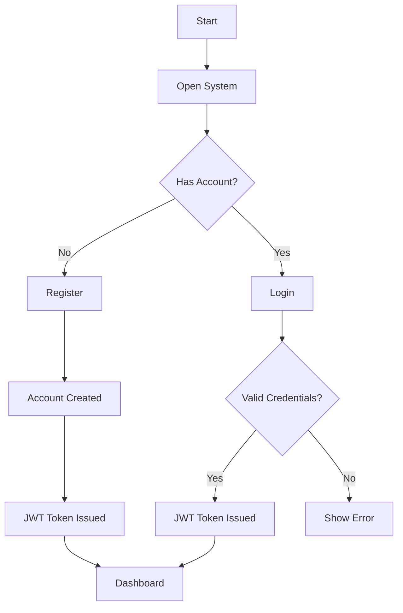
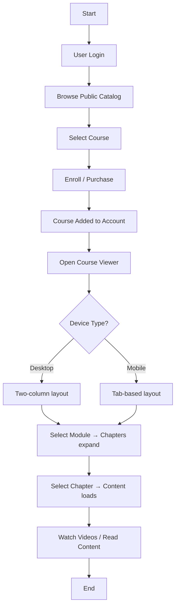
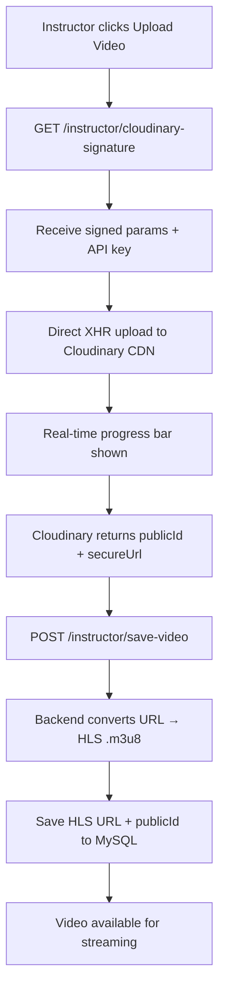
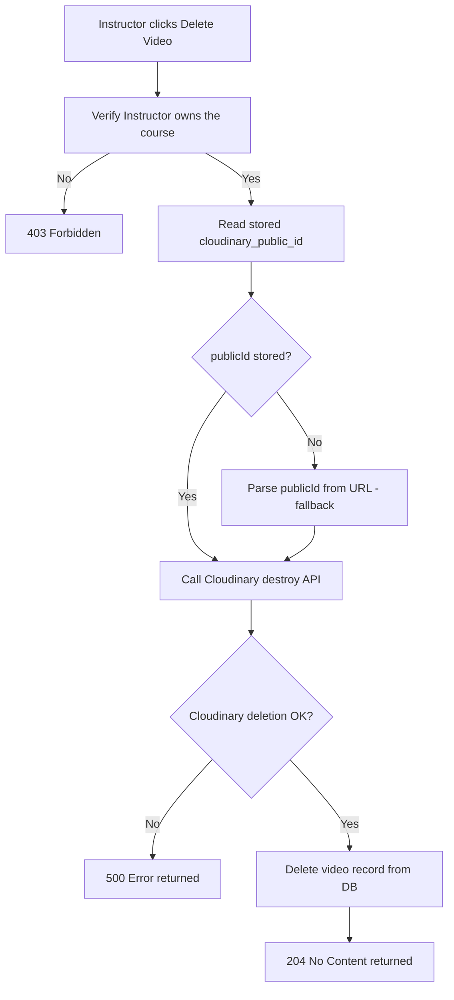
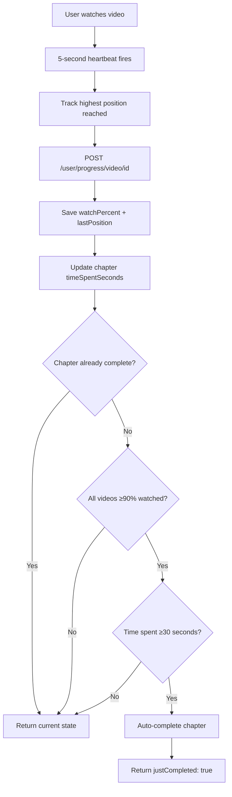
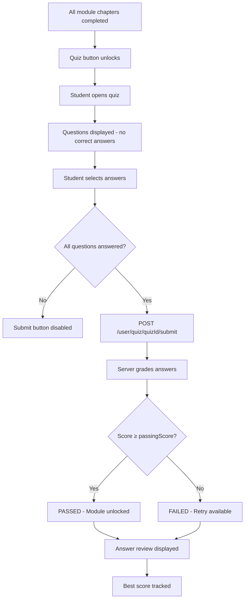
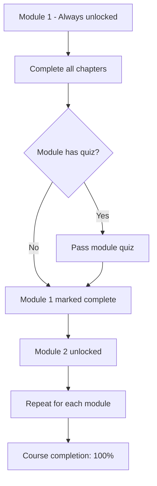
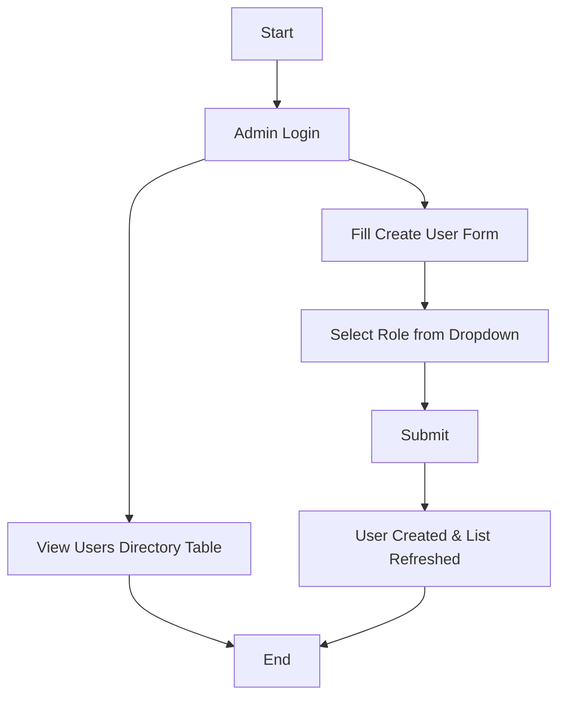

# 📘 Functional Document – LearnFlow LMS

## 1) Purpose
This document describes **what LearnFlow does and how users interact with it**. It covers all implemented system features including role-based access, course content delivery, HLS video streaming, smart progress tracking, quiz assessments, instructor analytics, and admin management.

---

## 2) Project Scope

### ✅ Implemented Features
LearnFlow is a production-deployed, full-stack Learning Management System that supports:

- **Authentication & Authorization** — JWT-based stateless auth with BCrypt password hashing and role-based access control (RBAC)
- **Three-Tier Role System** — User (Learner), Instructor, and Admin roles with granular permissions
- **Public Course Catalog** — browsable without authentication, with cover images and status badges
- **Course Enrollment** — users can purchase/enroll in published courses
- **Instructor Studio** — full CRUD for courses, modules, chapters, and videos
- **Direct-to-CDN Video Uploads** — signed uploads from browser to Cloudinary with real-time progress bars
- **HLS Adaptive Streaming** — automatic conversion to `.m3u8` streams with `hls.js` and MP4 fallback
- **Smart Progress Tracking** — per-video watch tracking, automatic chapter completion, resume playback
- **Quiz Assessment Engine** — timed MCQ tests, auto-grading, answer review, best-score tracking
- **Sequential Module Unlocking** — modules unlock when all chapters + quiz are completed
- **Instructor Analytics** — enrollment counts, completion rates, content breakdown metrics
- **Quiz Results Dashboard** — per-student attempt history with pass/fail statistics
- **Admin Panel** — user directory with role-based user creation
- **Responsive Design** — mobile tab-based course viewer, collapsible sidebar navigation
- **Auto-Seeded Admin** — default admin user created on first startup via `AdminConfig`

### 🚀 Planned Features
- AI-powered course assistant for learner Q&A
- Payment gateway integration
- Certificate generation on course completion

---

## 3) User Roles

### 👤 Guest (Unauthenticated)
- View the public course catalog with course details
- Create a new account (sign up)
- Log in to an existing account

### 👤 User (Learner)
- View personal dashboard with profile and enrolled courses
- Purchase/enroll in published courses
- **Course Viewer** — browse modules, chapters, and watch videos
  - Desktop: two-column layout (syllabus + content side-by-side)
  - Mobile: tab-based layout (📚 Syllabus / 📖 Content switch)
- **Video Playback** — HLS adaptive streaming with resume-from-last-position
- **Progress Tracking** — automatic chapter completion based on video watch percentage
- **Manual Completion** — mark text-only chapters as complete
- **Module Quizzes** — take timed MCQ tests at the end of each module
  - View instant score, pass/fail result, and answer review
  - Retry failed quizzes; best score tracked across attempts
- View course completion percentage in real time

### 👨‍🏫 Instructor
- **Create Course** — dedicated form with cover image upload, pricing, status, and duration
- **Edit / Delete** courses they own
- **Toggle Course Status** — switch between `DRAFT`, `PUBLISHED`, and `ARCHIVED`
- **Manage Modules** — create, edit, and delete modules within a course
- **Manage Chapters** — create, edit, and delete chapters within a module
- **Upload Videos** — direct-to-Cloudinary signed upload with real-time progress bar
- **Delete Videos** — atomic removal from both Cloudinary CDN and database
- **Quiz Builder** — create module tests with MCQ questions, passing scores, and time limits
- **Quiz Question CRUD** — add, edit, and delete individual questions with option management
- **Course Analytics** — view enrollment counts, content breakdown, and student completion rates
- **Quiz Results** — view all student attempts, scores, and pass/fail statistics per quiz

### 🛠 Admin
- View directory of all registered users with roles and course counts
- Create new users with explicit role assignment via styled form
  - Available role presets: `USER`, `INSTRUCTOR`, `ADMIN`, `USER + INSTRUCTOR`, `USER + ADMIN`
- All Instructor capabilities (Admin role includes Instructor access)

---

## 4) Functional Modules

### 4.1 User Registration & Login
- Users create an account via the registration form
- Login returns a JWT token stored in `localStorage`
- System identifies user roles from JWT claims
- Auto-seeded admin account available on first startup
- Auth context provides `isAuthenticated`, `isInstructor`, `isAdmin` flags across the app

---

### 4.2 Course Catalog
- Public catalog displays all published courses
- Each course card shows: name, description, price, duration, status badge, and cover image
- No authentication required to browse
- Enrolled users see "View Course" button; others see "Enroll" option

---

### 4.3 Instructor Studio
- **Studio Dashboard** — lists all courses owned by the instructor with CRUD actions
- **Create Course Page** — dedicated form with cover image upload to Cloudinary
- **Course Builder** — two-panel layout for managing modules and chapters:
  - **Left panel**: Module list with add/edit/delete functionality
  - **Right panel**: Chapter list for selected module with expandable video sections
- Each chapter card shows video count and supports inline video upload/delete

---

### 4.4 Video Upload & Streaming Pipeline
- **Upload Flow**:
  1. Frontend requests a signed upload signature from `GET /instructor/cloudinary-signature`
  2. File uploads **directly from browser to Cloudinary** via XHR (no backend proxy)
  3. Real-time upload progress displayed via progress bar
  4. Frontend sends `publicId` and `videoUrl` to `POST /instructor/save-video`
  5. Backend converts URL to HLS `.m3u8` format and persists with `cloudinary_public_id`
- **Playback**:
  - `hls.js` handles adaptive bitrate streaming on Chrome/Firefox/Edge
  - Safari uses native HLS support
  - Automatic MP4 fallback if HLS manifest loading fails
  - Videos play in 16:9 aspect ratio with download/PiP disabled
- **Deletion**:
  - Ownership verified (instructor must own the course)
  - Cloudinary asset destroyed via `publicId`, then DB record deleted
  - Fallback URL parsing for legacy videos without stored `publicId`

---

### 4.5 Smart Progress Tracking
- **Video Watch Progress**:
  - 5-second heartbeat interval tracks `watchPercent` and `lastPosition`
  - Highest position reached is tracked (seeking back doesn't reduce progress)
  - Anti-cheat: heartbeat time deltas clamped to 120 seconds max
- **Chapter Auto-Completion**:
  - Chapters auto-complete when ALL videos are ≥90% watched AND ≥30 seconds time spent
  - Text-only chapters (no videos) can be manually marked as complete
- **Course Completion**:
  - Overall course completion percentage calculated from all module chapters
  - Visual progress bars displayed at course and chapter levels
- **Resume Playback**:
  - `lastPosition` persisted per video, enabling resume-from-where-you-left-off

---

### 4.6 Quiz Assessment Engine
- **Quiz Creation** (Instructor):
  - One quiz per module (one-to-one relationship)
  - Configurable title, passing score (%), and optional time limit (minutes)
  - MCQ questions with 4 options, one correct answer per question
  - Full CRUD: add, edit, delete questions; delete entire quiz
- **Quiz Taking** (Student):
  - Available only after all module chapters are completed
  - Questions displayed without correct answers
  - All questions must be answered before submission
  - Instant auto-grading with score percentage and pass/fail result
  - Answer review showing correct answers and user's selections
  - Retry available for failed attempts; best score tracked
- **Module Unlocking**:
  - Modules unlock sequentially — previous module must be fully completed (all chapters + quiz passed)
  - Locked modules appear dimmed with 🔒 icon in syllabus
- **Quiz Results Dashboard** (Instructor):
  - Total attempts, passed count, pass threshold summary
  - Per-student table: name, score, correct answers, pass/fail status, date

---

### 4.7 Instructor Analytics
- **Metric Tiles**: enrolled students, module count, chapter count, video count
- **Completion Ring**: SVG donut chart showing overall completion rate
- **Completion Details**: completed chapters, total possible completions, avg chapters per student
- **Content Breakdown**: horizontal bar chart comparing modules, chapters, and videos
- Accessible via `📊 Analytics` button in the Course Builder

---

### 4.8 Course Purchase
- Users can enroll in published courses from the catalog or dashboard
- Purchased courses are linked to the user account
- Enrolled courses appear on the user's dashboard with a "View Course" action

---

### 4.9 Admin Features
- User directory table showing all registered users with their roles
- Create new users via a styled form with role dropdown selector
- Available role presets cover single and combined role assignments

---

## 5) Rules & Conditions
- Only authenticated users can perform actions requiring authorization
- Instructors can only manage courses, modules, chapters, and videos they own
- Every mutating API call verifies resource ownership before execution
- Deleting a video atomically removes both the Cloudinary asset and database record
- Quiz submission requires all questions to be answered
- Module access is sequentially gated by previous module completion + quiz pass
- Video watch progress uses anti-cheat clamping (max 2-minute deltas per heartbeat)
- Chapter auto-completion requires ≥90% video watch AND ≥30 seconds time spent
- Users cannot access other users' data or progress
- CORS is configured for `localhost` and the production domain

---

## 6) Acceptance Criteria

System is successful if:
- User can register, log in, and receive a valid JWT
- Courses are visible to everyone in the public catalog
- Instructor manages only own courses, modules, chapters, and videos
- Video upload stores to Cloudinary via signed direct upload and saves HLS URL
- Video delete removes from both Cloudinary and DB atomically
- User can enroll in a course and access the Course Viewer
- Course Viewer shows two-column layout on desktop and tab layout on mobile
- Clicking a chapter loads content and videos without layout shift
- Progress auto-tracks video watch percentage with 5-second heartbeats
- Chapters auto-complete when all videos ≥90% watched and ≥30s time spent
- Module quizzes can be created, taken, auto-graded, and reviewed
- Modules unlock sequentially based on chapter + quiz completion
- Analytics dashboard shows enrollment, completion, and content metrics
- Admin can see user directory and create new users with roles

---

## 7) Out of Scope
(Not included in current version)
- Online payment processing
- Multi-language / i18n support
- Voice assistant
- Certificate generation
- AI-powered course Q&A assistant

---

# 🔄 Flowcharts

## 1) User Registration & Login Flow

## 2) Course Enrollment & Viewing Flow

## 3) Video Upload Pipeline

## 4) Video Delete Flow

## 5) Smart Progress Tracking Flow

## 6) Quiz Assessment Flow

## 7) Module Sequential Unlocking Flow

## 8) Admin Management Flow

